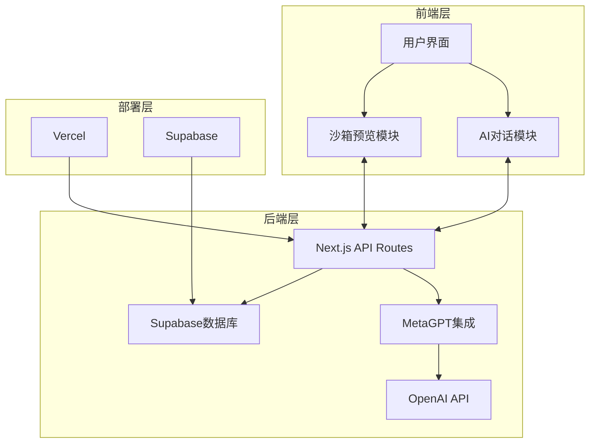

# AI Code Builder 48小时快速实施架构文档

## 1. 项目概述

### 1.1 项目背景
本项目旨在构建一个类似MGX.dev的平台，通过网页智能体对话让AI通过自然语言构建完整的代码项目。利用MetaGPT的多智能体协作能力，结合Supabase和Vercel的部署优势，为用户提供从需求分析到代码实现的全流程AI辅助开发体验。

### 1.2 时间限制
**总开发时间：48小时**
- 第一阶段：24小时（基础架构和核心功能）
- 第二阶段：24小时（功能完善和部署）

### 1.3 功能优先级
| 优先级 | 功能类别 | 具体功能 | 时间分配 |
|--------|----------|----------|----------|
| **P0（必须完成）** | 核心功能 | 自然语言接口、多智能体协作、基础沙箱预览 | 24小时 |
| **P1（重要）** | 增强功能 | 代码编辑、文件管理、项目部署 | 12小时 |
| **P2（优化）** | 优化功能 | 实时通信、性能优化、用户体验改进 | 12小时 |

## 2. 系统架构

### 2.1 整体架构

### 2.2 48小时内必须完成的架构组件
| 组件 | 功能 | 技术实现 | 优先级 |
|------|------|----------|--------|
| **前端层** | 用户界面框架 | Next.js + React + Tailwind CSS | P0 |
| | AI对话模块 | React组件 + 简单HTTP请求 | P0 |
| | 沙箱预览模块 | Sandpack + 简单终端模拟 | P0 |
| **后端层** | API Routes | Next.js API Routes | P0 |
| | MetaGPT集成 | 基础MetaGPT功能 | P0 |
| | 数据库 | Supabase基础表结构 | P0 |
| **部署层** | Vercel部署 | 基础部署配置 | P0 |
| | Supabase配置 | 基础数据库和认证 | P0 |

### 2.3 后续优化的架构组件
| 组件 | 功能 | 技术实现 | 优先级 |
|------|------|----------|--------|
| **前端层** | 实时通信 | Socket.io | P2 |
| | 高级代码编辑器 | Monaco Editor | P1 |
| | 响应式设计 | 移动端适配 | P2 |
| **后端层** | 高级沙箱服务 | Docker容器 | P2 |
| | 智能体扩展 | 更多专业智能体 | P1 |
| | 缓存系统 | Redis缓存 | P2 |
| **部署层** | 自定义域名 | 域名配置 | P2 |
| | 边缘函数 | Vercel Edge Functions | P2 |

## 3. 技术栈选择

### 3.1 核心技术栈（必须使用）
| 技术 | 版本 | 用途 | 选择理由 |
|------|------|------|----------|
| Next.js | 14+ | 前端/后端框架 | 同构应用，内置API Routes，部署简单 |
| React | 18+ | UI库 | 生态成熟，组件化开发 |
| Tailwind CSS | 4.0+ | 样式框架 | 开发效率高，响应式设计 |
| Supabase | 最新 | 数据库/认证 | 开源PostgreSQL，内置认证，配置简单 |
| MetaGPT | 最新 | AI框架 | 多智能体协作，全流程自动化 |
| OpenAI API | 最新 | LLM | 强大的语言理解和生成能力 |
| Vercel | 最新 | 部署平台 | 与Next.js深度集成，自动部署 |
| Sandpack | 最新 | 前端沙箱 | 实时预览，热更新，集成简单 |

### 3.2 可选技术栈（后续优化）
| 技术 | 用途 | 选择理由 | 优先级 |
|------|------|----------|--------|
| Socket.io | 实时通信 | 支持智能体对话的实时更新 | P2 |
| Monaco Editor | 代码编辑器 | VS Code同款编辑器，功能强大 | P1 |
| Xterm.js | 终端模拟器 | 提供真实的命令行体验 | P1 |
| Docker | 沙箱服务 | 完整的隔离环境，支持更多技术栈 | P2 |
| Redis | 缓存系统 | 提高API响应速度，减少重复计算 | P2 |

## 4. 核心功能模块

### 4.1 P0 核心功能（24小时）

#### 4.1.1 AI对话模块
- **功能**：处理用户与AI智能体的对话
- **实现**：
  - 简单的React对话界面
  - HTTP请求处理对话
  - 基础的智能体切换
- **关键特性**：
  - 用户输入自然语言需求
  - AI智能体生成响应
  - 对话历史显示
- **时间分配**：6小时

#### 4.1.2 沙箱预览模块
- **功能**：显示AI在沙箱中的基本动作
- **实现**：
  - 集成Sandpack基础功能
  - 简单的终端输出模拟
  - 基础的动作日志
- **关键特性**：
  - 前端代码实时预览
  - 命令执行结果显示
  - 动作序列记录
- **时间分配**：8小时

#### 4.1.3 后端API模块
- **功能**：处理前端请求，集成MetaGPT
- **实现**：
  - Next.js API Routes
  - 基础MetaGPT集成
  - 简单的请求处理
- **关键特性**：
  - 需求分析和处理
  - 智能体协作管理
  - 代码生成和返回
- **时间分配**：6小时

#### 4.1.4 数据库模块
- **功能**：存储用户数据和项目信息
- **实现**：
  - Supabase基础表结构
  - 简单的数据模型
  - 基础的CRUD操作
- **关键特性**：
  - 用户认证
  - 项目管理
  - 文件存储
- **时间分配**：4小时

### 4.2 P1 重要功能（12小时）

#### 4.2.1 代码管理模块
- **功能**：管理生成的代码文件
- **实现**：
  - 简单的文件浏览器
  - 基础的代码编辑功能
  - 文件上传和下载
- **关键特性**：
  - 文件结构显示
  - 代码编辑
  - 文件操作
- **时间分配**：6小时

#### 4.2.2 项目部署模块
- **功能**：部署生成的项目到Vercel
- **实现**：
  - Vercel API集成
  - 简单的部署流程
  - 部署状态显示
- **关键特性**：
  - 一键部署
  - 部署状态监控
  - 部署URL返回
- **时间分配**：6小时

### 4.3 P2 优化功能（12小时）

#### 4.3.1 实时通信模块
- **功能**：实时更新对话和沙箱状态
- **实现**：
  - Socket.io集成
  - 实时消息传递
  - 状态同步
- **关键特性**：
  - 实时对话更新
  - 沙箱状态实时同步
  - 减少延迟
- **时间分配**：4小时

#### 4.3.2 性能优化模块
- **功能**：提高系统性能和响应速度
- **实现**：
  - 代码分割
  - 缓存策略
  - 资源优化
- **关键特性**：
  - 更快的页面加载
  - 更流畅的用户体验
  - 减少API调用
- **时间分配**：4小时

#### 4.3.3 用户体验改进
- **功能**：提升用户界面和交互体验
- **实现**：
  - 响应式设计
  - 动画效果
  - 错误处理
- **关键特性**：
  - 移动端适配
  - 更直观的操作
  - 友好的错误提示
- **时间分配**：4小时

## 5. 数据模型设计

### 5.1 核心数据模型（必须完成）
| 表名 | 主要字段 | 功能 | 优先级 |
|------|----------|------|--------|
| **users** | id, email, password_hash, name | 用户管理 | P0 |
| **projects** | id, user_id, name, description, status | 项目管理 | P0 |
| **files** | id, project_id, name, path, content, type | 文件管理 | P0 |
| **conversations** | id, project_id, role, content, agent_type | 对话管理 | P0 |

### 5.2 扩展数据模型（后续优化）
| 表名 | 主要字段 | 功能 | 优先级 |
|------|----------|------|--------|
| **actions** | id, project_id, type, description, details | 动作记录 | P1 |
| **agents** | id, name, type, description, config | 智能体管理 | P1 |
| **deployments** | id, project_id, vercel_url, status | 部署管理 | P1 |

## 6. 部署方案

### 6.1 快速部署步骤（P0）
1. **Supabase配置**（2小时）
   - 创建Supabase项目
   - 执行基础SQL脚本创建数据表
   - 启用邮箱/密码认证
   - 配置基本存储桶

2. **Vercel部署**（2小时）
   - 从GitHub导入项目
   - 配置环境变量
   - 执行首次部署
   - 验证部署成功

### 6.2 环境变量配置
| 环境变量 | 用途 | 优先级 |
|----------|------|--------|
| `NEXT_PUBLIC_SUPABASE_URL` | Supabase项目URL | P0 |
| `NEXT_PUBLIC_SUPABASE_ANON_KEY` | Supabase匿名密钥 | P0 |
| `SUPABASE_SERVICE_ROLE_KEY` | Supabase服务角色密钥 | P0 |
| `OPENAI_API_KEY` | OpenAI API密钥 | P0 |
| `META_GPT_CONFIG` | MetaGPT配置 | P0 |
| `VERCEL_API_KEY` | Vercel API密钥（用于部署功能） | P1 |

## 7. 48小时实施路线图

### 7.1 第一阶段：24小时（核心功能）
| 时间 | 任务 | 负责模块 | 优先级 |
|------|------|----------|--------|
| **0-4小时** | 项目初始化和基础配置 | 前端框架、Supabase | P0 |
| **4-10小时** | AI对话模块开发 | 前端、后端API | P0 |
| **10-18小时** | 沙箱预览模块开发 | 前端、Sandpack集成 | P0 |
| **18-22小时** | 数据库集成 | 后端、Supabase | P0 |
| **22-24小时** | 基础功能测试 | 全系统 | P0 |

### 7.2 第二阶段：24小时（功能完善和部署）
| 时间 | 任务 | 负责模块 | 优先级 |
|------|------|----------|--------|
| **24-30小时** | 代码管理模块开发 | 前端、后端 | P1 |
| **30-36小时** | 项目部署模块开发 | 后端、Vercel集成 | P1 |
| **36-40小时** | 实时通信集成 | 前端、后端 | P2 |
| **40-44小时** | 性能优化和用户体验改进 | 全系统 | P2 |
| **44-48小时** | 最终测试和部署 | 全系统 | P0 |

## 8. 技术挑战与快速解决方案

### 8.1 核心挑战
| 挑战 | 影响 | 快速解决方案 |
|------|------|--------------|
| **时间紧迫** | 功能可能无法完全实现 | 专注P0功能，采用最小可行产品策略 |
| **MetaGPT集成复杂度** | 可能导致开发延迟 | 使用预配置的MetaGPT实例，简化集成 |
| **沙箱性能限制** | 影响用户体验 | 使用Sandpack的基础功能，避免复杂配置 |
| **实时通信实现** | 技术复杂度高 | 初期使用轮询，后续优化为WebSocket |
| **数据库设计** | 可能影响扩展性 | 使用简单的数据模型，后续迭代优化 |

### 8.2 快速开发技巧
- **使用模板**：利用Next.js模板快速初始化项目
- **代码复用**：使用开源组件和库，减少重复开发
- **并行开发**：前端和后端同时开发，减少等待时间
- **简化设计**：采用简约设计，专注功能实现
- **自动化测试**：使用基本的自动化测试，确保核心功能正常

## 9. 预期成果

### 9.1 48小时内必须完成的成果
- **功能完备的原型**：支持自然语言输入、智能体协作、基础沙箱预览
- **可部署的应用**：成功部署到Vercel，可通过URL访问
- **基础的用户流程**：用户可通过自然语言创建简单项目
- **核心技术验证**：验证MetaGPT、Supabase、Vercel的集成可行性

### 9.2 后续优化方向
- **功能扩展**：添加更多智能体类型，支持更多编程语言
- **性能优化**：提升沙箱性能，优化实时通信
- **用户体验**：改进界面设计，增加动画效果
- **生态系统**：构建插件系统，支持第三方集成

## 10. 结论

在48小时的时间限制内，我们将专注于构建一个功能完备的AI Code Builder原型，实现核心功能并确保成功部署。通过明确的优先级划分和高效的开发策略，我们可以在有限时间内交付一个有意义的产品，同时为后续的优化和扩展奠定基础。

这个项目展示了AI技术在软件开发领域的巨大潜力，通过多智能体协作和实时沙箱预览，为用户提供全新的开发体验。虽然时间有限，但我们将尽最大努力构建一个功能完整、用户友好的平台，展示AI辅助开发的未来方向。